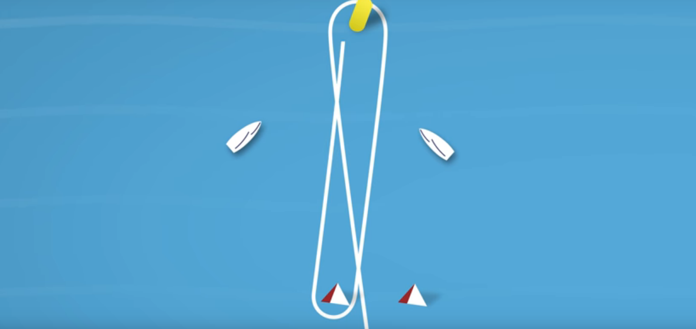
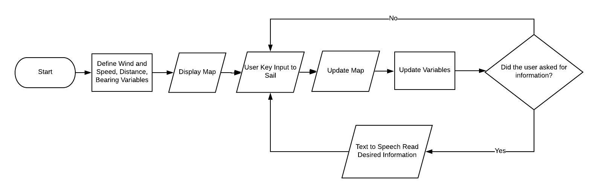
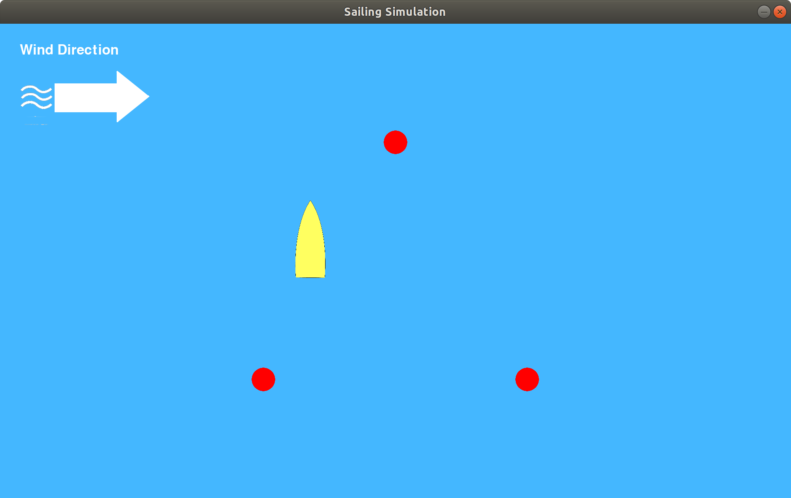

## Blind Sailing
### The Big Idea
Blind Sailing International has been attempting to create a clean and effective solution for blind individuals who want to sail competitively for some years. For several years now, project teams at Olin have attempted to help this initiative by coding a better solution. This means there is a lot of existing code that is only partially functional. The main goal of our project was to improve the functionality and accessibility of the blind sailing project for anyone who may wish to have access. We decided to accomplish this goal by targeting a few specific features to fix, and then implementing them into a pygame simulation so that people can better understand the tools we have provided, without the hassle of going out and actually attempting to sail. In this way, our blind sailing software can even be used to help teach new users the fundamentals of sailing. We chose two specific features to ammend or include, along with the implementation of the simulation. Our simulation includes a demonstration of the functionality of our renditions of the text to speech and navigation algorithm processes. All other parts of the blind sailing code can be accredited to past teams.




### User Instructions (Important!!)
Along with cloning and running our code, there are a few things the user must do in order to gain access to the full functionality of our code. Open up the command terminal in your computer, and paste the following commands into your terminal (using ctr-shift-v). After pasting each one, press enter to run and download the packages.

```
python3 -m pip install -U pygame --user
```

```
pip install pydub
```
```
pip install ffmpy
```
```
sudo apt update
sudo apt install ffmpeg
```
```
pip install soundfile
```

```
pip install gTTS
```

Once these are installed, the user should be able to simply clone this repository, run our code, and perform the simulation.


### Implementation

Our code, having pieces that have existed for some years before us, will carry an interesting format. Firstly, the pieces of code we chose to improve of the previous project teams (the text to speech and navigation algorithm) are a subset of a lot of existing classes. We are taking these classes that we have "improved" and using them in a visual demonstration, shown in a pygame. Our code will be structured as the diagram below.



Context as to what each piece of the flowchart means is also provided below:


In general terms, our final product is a simulation that allows the user to control the boat. There will be varying conditions, and the user may input a request to any of a list of variables (distance to buoy, bearing to buoy, etc), which will then be relayed to them through text to speech.

A portion of code that highlights the mapping of the key inputs is included below:

```markdown

# Description of KeyPad Inputs

def texty(num):
    #assigning what messages the text to speech should say when certain buttons are pressed
    snippet = ''
    if num == 1:
        snippet = get_distance_sentence()
    elif num == 2:
        snippet = get_clock_heading_sentence()
    elif num == 3:
        snippet = 'The wind is blowing East'
    elif num == 4:
        snippet = get_cardinal_direction()
    elif num == 5:
        snippet = 'Advancing to next buoy'
    elif num == 6:
        snippet = "Slow speech mode"
    elif num == 7:
        snippet = "Fast speech mode"
    elif num == 8:
        snippet = "Very fast speech mode"
    return snippet
 
```

### Results
Our final product is a pygame simulation of sailing. The simulation contains the ability to control a boat on the water. The user must navigate the course while controlling the bearing of the boat and sail direction, and all the while there is wind blowing, and affecting all of these things. The user also has access to a set of tools very similar to those a blind sailor would have while using the blind sailing software Olin has created out on the water. The following is a capture of our current software. 




### Software Impact Statement
We had three main ethical considerations when we started the Blind Sailing Project. First of all we wanted to share the code and let sailors to build their own system and use our code. We didn’t wanted to distribute the device to project ourselves and Olin from any liabilities. In order to achieve this goal, we made our code open source to share what we have done and give the freedom of implementation to the users. Because we are concerned about everyone’s safety, we have also included a statement in our ReadMe that says, “To protect yourself and others, please do not use this software on water if you are not an experienced sailor or accompanied by an instructor. Although our simulation is a good learning exercise, it will not teach you all of the necessary skills to operate a boat. Please seek additional education from certified sailing instructors before going on water. Another ethical consideration we had to be aware of was acknowledging that everyone is not a software developer and may have limited knowledge on python. If we wanted our code to reach many people and have a big impact, we had to put extra effort in coding it in a simple way and formatting it in a user-friendly format. Our last challenge was making a software that would not be against the current blind sailing culture and be welcomed by the existing blind sailors. To have the best results in that, we did not make any assumptions and contacted the Blind Sailing Organization. They told us that they only wanted the software to provide information about the status of the surroundings, but not instructions about how to operate to boat. So we made a software that gives only the distance and bearings to buoys and to other boats. What to do with this information is left to the sailor. 


### Project Evolution
Our project has evolved wildly over time. What began as simply the task "make some existing code work" turned into "take little pieces and make them work, and BETTER" which has since turned into "take some pieces, make them work better, and demonstrate this visually inside a pygame." Sadly this has resulted in a lot of hard work being sidelined. Originally, we spent tons of time talking to the teams from the past two years about how different portions of the code worked. Thankfully, although many of these pieces that we spent tons of time understanding don't need to be edited, understanding the whole structure is key to being able to edit any small piece. For the text to speech specifically, we stayed in contact with a former blind sailing student, once we had narrowed down our vision on perfecting the TTS. We decided to make our largest pivot when we realized that the scope of our project was very difficult to moderate. We were stuck at a point where we either finished all of it off very easily or we never would get it to work at all. Therefore, we decided to take an approach that would more effectively deal with our learning goals, and we moved towards the visual representation of what's happening with the blind sailing system. 

### Credit Where it's Due

First we'd like to give a big thanks to the people who have done so much work on the blind sailing code, the blind sailing teams from 2017 and 2018, and Alex Morrow. Without them it would have been hard to know where to begin. 

We must also give credit to Blind Sailing International. Blind Sailing International created most of the informative information that we use to explain the concepts, and they created the video from which we took the representation of the blind sailing course. 
(https://www.youtube.com/watch?v=h2csQ_rdOtE&feature=youtu.be&t=25)
